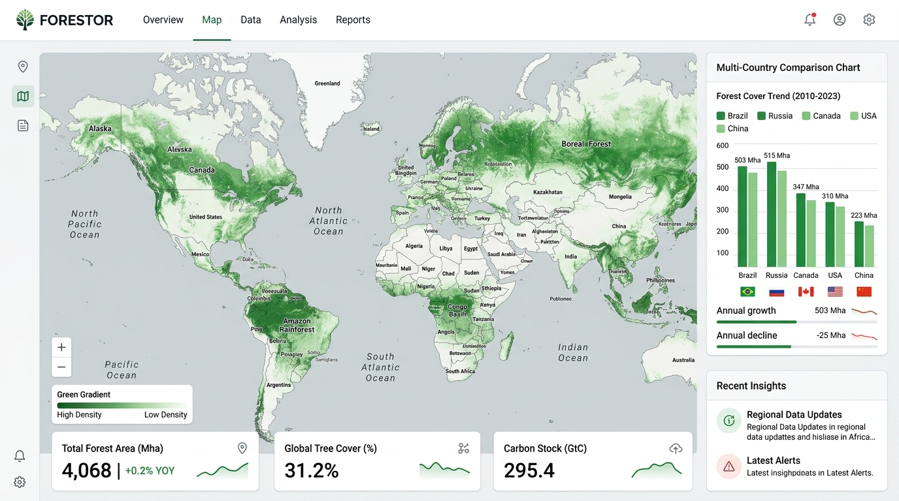

<div align="center">
  

  <p><strong>Observatoire Mondial des Ressources Forestières • FAO Global Forest Resources Assessment (FRA 2025)</strong></p>

  <p>
    
    
    
    
    
    
    
  </p>
</div>

---

## 📸 Aperçu de l'Application

<div align="center">
  
</div>

---

## 🌲 Présentation & Mission

**Forestor** est une plateforme scientifique, pédagogique et indépendante d'exploration des ressources forestières de notre planète. Elle exploite l'intégralité du corpus officiel du **Global Forest Resources Assessment (FRA 2025)** de la **FAO (Organisation des Nations Unies pour l'alimentation et l'agriculture)** couvrant **236 pays et territoires** de 1990 à 2025.

L'application respecte des principes déontologiques stricts :
- **Zéro statistique inventée ou extrapolée arbitrairement** : chaque métrique provient directement des inventaires forestiers nationaux (IFN) et des rapports d'experts de la FAO.
- **Principe fondamental `null ≠ 0`** : l'absence de déclaration d'un pays est explicitement affichée comme *"Non renseigné"* avec une trame hachurée distinctive, sans jamais induire en erreur en la remplaçant par zéro.
- **Traçabilité totale des calculs dérivés** : les ratios (densité carbone, parts protégées, variation annuelle) sont munis d'un badge *"Calcul Forestor"* et de leur formule explicite.

---

## 🌟 Nouvelles Fonctionnalités & Modules

### 🍔 1. Menu Hamburger Catégorisé
Accessible sur ordinateur comme sur mobile via l'icône de menu, il organise toutes les fonctionnalités de l'application en 4 catégories claires :
- **🌲 Exploration & Analyse** :
  - *Vue d'ensemble mondiale* : KPIs planétaires FRA 2025 (4,06 Mds ha, 31,2% de couverture, 662 Gt de carbone).
  - *Fiche détaillée Pays* : Analyse approfondie par nation avec séries chronologiques 1990–2025.
  - *Comparateur Multi-Pays* : Analyse simultanée libre et benchmarking sans limite de pays.
- **🗺️ Cartographie & Données** :
  - *Carte Mondiale Interactive* : Cartographie vectorielle SVG choroplèthe en 5 quantiles avec zoom/panoramique.
  - *Catalogue des 21 Indicateurs* : Définitions complètes, unités standardisées et filtres thématiques.
- **📖 Méthodologie & Références** :
  - *Sources officielles & Méthode FAO* : Documentation nationale, métadonnées IFN et licences.
  - *Centre d’aide & Glossaire* : Définitions des termes clés (forêt primaire, OWL, biomasse, carbone).
  - *Visite guidée interactive* : Onboarding interactif en 4 étapes pour découvrir les points forts de l'outil.
- **⚙️ Paramètres Système & Préférences** :
  - *Panneau de diagnostic & mises à jour* : Contrôle en direct de l'état applicatif.
  - *Gestionnaire de Thème* : Sélecteur Clair, Sombre et Système.
  - *Sélecteur de Langue* : Bilingue Français (FR) et Anglais (EN).

---

### ⚙️ 2. Paramètres Système & Mises à Jour Automatiques en Arrière-Plan

Un volet complet de gestion du cycle de vie de l'application accessible depuis l'en-tête et le menu hamburger :
- 📅 **Date de sortie** : `Version 1.2.0 • 28 Septembre 2026`.
- ⏱️ **Date de dernière vérification** : Horodatage précis de la dernière vérification effectuée auprès du Service Worker et du serveur.
- 🔄 **Bouton « Vérifier les mises à jour »** : Déclenche une vérification immédiate du cache et du manifest sans recharger la page.
- ⚡ **Bouton « Forcer la mise à jour »** : Purge l'intégralité du CacheStorage et des états temporaires locaux puis réinitialise l'application pour charger instantanément la version la plus fraîche.
- 🛰️ **Mises à jour automatiques en arrière-plan** :
  - Système autonome qui surveille périodiquement (toutes les 15 min, 30 min, 1h ou 6h) la disponibilité de nouvelles versions.
  - Téléchargement et installation silencieux en arrière-plan sans bloquer la navigation.
  - Bandeau discret avertissant l'utilisateur lorsqu'une nouvelle version est prête.
  - Détection automatique au retour de connexion (`online`) et au focus de l'onglet (`visibilitychange`).

---

### ☀️ 3. Thème Clair & Thème Sombre

Forestor propose un thème **Clair** épuré et lumineux, spécialement conçu pour la lecture de données scientifiques et graphiques complexes :
- Palette naturelle inspirée des canopées forestières (verts émeraudes, teintes pierre naturelle).
- Contraste typographique rigoureusement calibré (WCAG AA).
- Bascule instantanée entre **Clair**, **Sombre** et **Automatique (Système)** avec mémorisation dans le stockage local.

---

### 🧭 4. Onboarding & Visite Guidée

- Modal d'accueil interactif en 4 étapes guidant l'utilisateur à travers la carte, le comparateur, les indicateurs et le fonctionnement hors-ligne.
- Possibilité de cocher *"Ne plus afficher au démarrage"*.
- Relançable à tout moment depuis le menu Hamburger ou le centre d'aide.

---

### 💡 5. Aide Contextuelle & Infobulles

- **Infobulles interactives** (`<Tooltip />`) sur les cartes métriques pour expliquer immédiatement la signification des données (Surface boisée, Forêt primaire, Stock de carbone, Densité carbone).
- **Centre d'Aide & Glossaire FAO** (`?`) : Recherche instantanée de définitions officielles (seuil de 0,5 ha, couvert > 10%, arbres > 5 m, réservoirs de biomasse).
- Guide d'explication sur la règle `null ≠ 0` et liste des raccourcis clavier (`/` recherche, `?` aide, `Esc` fermer).

---

## 🗺️ Répertoire des 21 Indicateurs Officiels FRA 2025

| Catégorie | Indicateur | Unité | Source FAO FRA |
| :--- | :--- | :--- | :--- |
| **Surfaces** | Superficie forestière totale | $1000\text{ ha}$ / $\text{ha}$ | `extentOfForest.forestArea` |
| **Surfaces** | Part de la forêt dans le territoire | $\%$ | `forestAreaProportionLandArea2015` |
| **Surfaces** | Autres terres boisées (OWL) | $1000\text{ ha}$ | `extentOfForest.otherWoodedLand` |
| **Composition** | Forêt de régénération naturelle | $1000\text{ ha}$ | `forestCharacteristics.naturalForestArea` |
| **Composition** | Forêt primaire déclarée | $1000\text{ ha}$ | `forestCharacteristics.primaryForest` |
| **Composition** | Forêt plantée | $1000\text{ ha}$ | `forestCharacteristics.plantedForest` |
| **Dynamiques** | Expansion forestière annuelle | $1000\text{ ha/an}$ | `forestAreaChange.forestExpansion` |
| **Dynamiques** | Déforestation annuelle brute | $1000\text{ ha/an}$ | `forestAreaChange.deforestation` |
| **Dynamiques** | Variation nette annuelle | $1000\text{ ha/an}$ | `forestAreaChange.netChange` |
| **Biomasse** | Biomasse aérienne totale | $\text{Mt}$ | `biomassStock.aboveGround` |
| **Biomasse** | Biomasse souterraine (racines) | $\text{Mt}$ | `biomassStock.belowGround` |
| **Carbone** | Stock de carbone total | $\text{Mt}$ | `carbonStockTotal.carbonTotal` |
| **Carbone** | Densité de carbone par hectare | $\text{t/ha}$ | Calcul Forestor dérivé |
| **Protection** | Forêts en aire protégée | $1000\text{ ha}$ | `forestAreaWithinProtectedAreas` |
| **Gouvernance** | Forêts sous plan de gestion à long terme | $1000\text{ ha}$ | `forestAreaWithLongTermManagementPlan` |
| **Propriété** | Forêts publiques | $1000\text{ ha}$ | `forestOwnership.publicOwnership` |
| **Propriété** | Forêts privées | $1000\text{ ha}$ | `forestOwnership.privateOwnership` |
| **Perturbations**| Surfaces affectées par les feux | $1000\text{ ha}$ | `areaAffectedByFire.total` |
| **Perturbations**| Surfaces affectées par insectes / maladies | $1000\text{ ha}$ | `disturbances.insects` / `diseases` |

---

## 💻 Raccourcis Clavier

| Raccourci | Action |
| :--- | :--- |
| <kbd>/</kbd> | Ouvre la barre de recherche globale instantanée |
| <kbd>?</kbd> | Ouvre le Centre d'aide et glossaire contextuel |
| <kbd>Esc</kbd> | Ferme le menu hamburger, la recherche ou toute fenêtre modale |

---

## 🛠️ Commandes Disponibles

```bash
# Lancer le serveur de développement local (port 3000)
npm run dev

# Exécuter les 21 tests unitaires Vitest (normalisation, calculs, qualité, updates)
npm run test

# Contrôle strict du typage TypeScript
npm run lint

# Compiler le bundle de production optimisé et la PWA
npm run build

# Prévisualiser la version de production compilée
npm run preview
```

---

## 📜 Attribution & Neutralité

- **Source primaire des données :** Organisation des Nations Unies pour l'alimentation et l'agriculture (**FAO**) — *Global Forest Resources Assessment (FRA 2025)*.
- **Licence des données :** Creative Commons Attribution 4.0 International (**CC BY 4.0**).
- **Indépendance :** Forestor est un projet indépendant, non affilié formellement à la FAO, développé dans le respect scrupuleux de l'intégrité des données scientifiques publiées.
